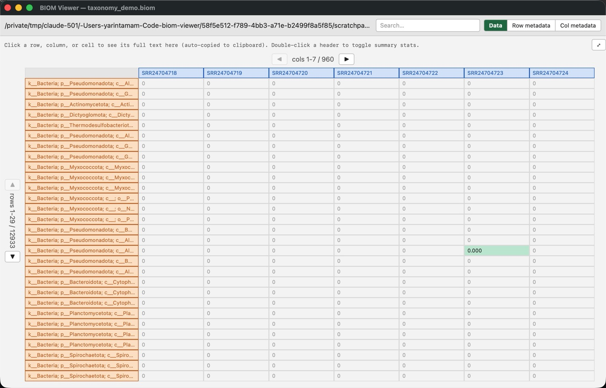
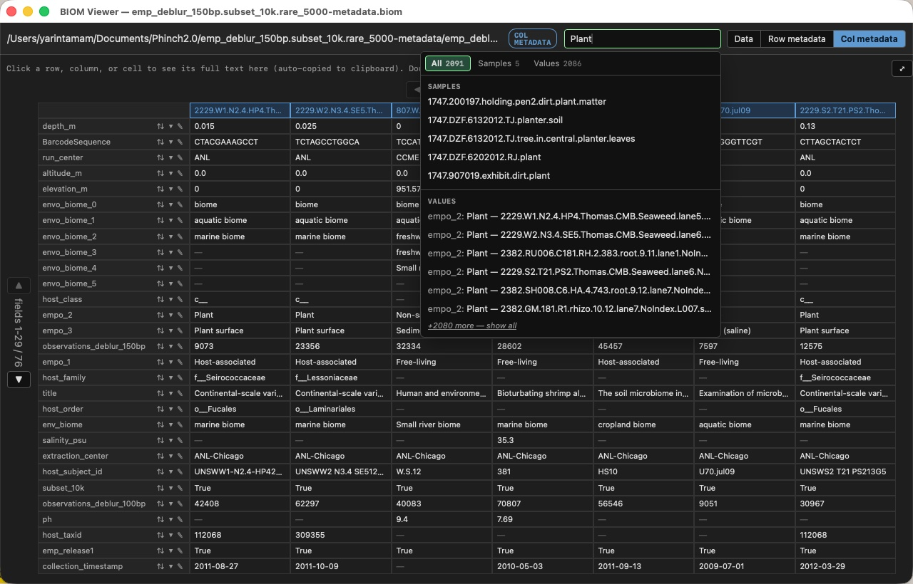

<p align="center">
  
</p>
<h1 align="center">biom-viewer</h1>
<p align="center">A desktop viewer for <code>.biom</code> files that never loads the full table into memory.</p>

<p align="center">
  <a href="https://github.com/yarintm/biom-viewer/releases/latest"></a>
  <a href="LICENSE"></a>
  
</p>

<p align="center">
  <a href="https://github.com/yarintm/biom-viewer/releases/latest/download/BiomViewer-macos-arm64.zip"><strong>⬇ Download for macOS</strong></a>
</p>

<p align="center">
  
</p>
<p align="center">
  
</p>

`.biom` files store microbiome/observation data as sparse matrices —
mostly zeros. Converting one to a normal table for viewing (`biom convert`,
pandas, Excel) densifies every implicit zero, so a 50MB file can blow up to
several GB of RAM before you've seen a single row. biom-viewer keeps the
table sparse and only densifies the small window of rows/columns currently
on screen.

## Install

Download the [latest release](https://github.com/yarintm/biom-viewer/releases/latest),
unzip, drag `BiomViewer.app` to Applications. It's self-contained — no
Python install required.

Download counts per release are tracked automatically by GitHub — see the
[releases page](https://github.com/yarintm/biom-viewer/releases) or run
`gh release view --json assets`.

To open `.biom` files by double-clicking: right-click one → **Get Info** →
**Open with** → **BiomViewer** → **Change All…**.

From source (any platform):

```bash
pip install -e .
biom-viewer path/to/table.biom
```

## Usage

- **▲ ▼** page through rows, **◀ ▶** through columns — page size auto-fits
  the window
- Click a row, column, or cell to copy its full text and highlight it;
  **⤢** (⌘⏎) opens the selection full-size in its own window
- **Data** / **Row metadata** / **Col metadata** mode switch
- Search across sample/observation IDs and metadata values (⌘F), with
  per-field results and a "show all" expansion
- Double-click a row header for summary stats (histogram, top values); in
  metadata mode, double-click a single field's row header to expand just
  that field
- Sort, filter, rename, or delete a metadata field from its column header
- Find & replace across metadata values (⌘R), with undo/redo (⌘Z / ⇧⌘Z)
- Export the current view as a Python snippet (⌘E) or as a new `.biom` file
  (⌘S)
- Theme toggle and font size (⌘+/⌘-) via the View menu
- Open more `.biom` files (double-click in Finder, or CLI) as new windows
  in the same running app

## Development

```bash
git clone https://github.com/yarintm/biom-viewer.git
cd biom-viewer
python3 -m venv .venv && source .venv/bin/activate
pip install -e ".[dev]"
pytest
```

`biom_viewer/app.py` is the whole app: a `pywebview` window (vanilla JS/CSS
grid, no framework) talking to a Python `Api` class that slices the sparse
matrix on demand — no HTTP server involved. `scripts/build_macos_app.sh`
bundles it into the standalone `.app` via PyInstaller.

See [CONTRIBUTING.md](CONTRIBUTING.md) before sending a PR — the one rule
that matters is not densifying the full table.

## License

[MIT](LICENSE)
