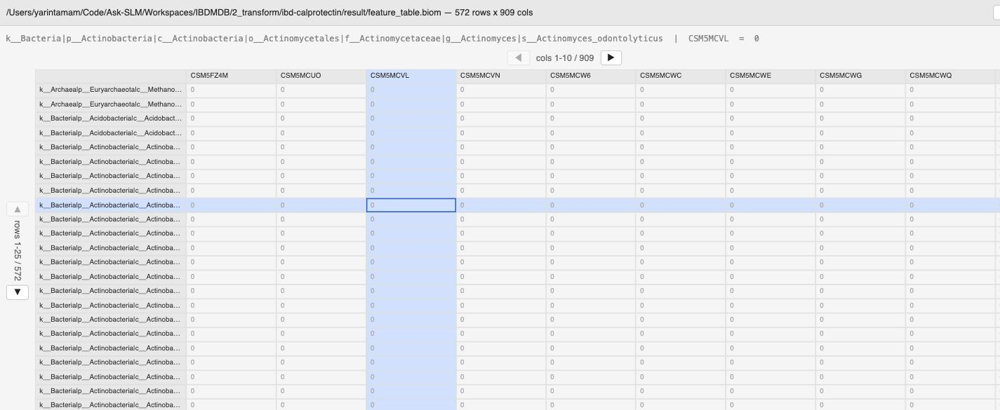

<p align="center">
  
</p>
<h1 align="center">biom-viewer</h1>
<p align="center"><strong>Instant, lazy-loading viewer for <code>.biom</code> files — never densifies the full sparse matrix.</strong></p>

<p align="center">
  <a href="https://github.com/yarintm/biom-viewer/releases/latest"></a>
  <a href="LICENSE"></a>
  <a href="pyproject.toml"></a>
  
</p>

<p align="center">
  <a href="https://github.com/yarintm/biom-viewer/releases/latest/download/BiomViewer-macos-arm64.zip"><strong>⬇ Download for macOS</strong></a>
</p>

A lightweight, double-clickable desktop viewer for **`.biom`** (Biological
Observation Matrix) files. Opens instantly, keeps its memory footprint tiny
no matter how large the file is, and never runs a manual `biom convert` for
you.

<p align="center">
  
</p>
<p align="center">
  
</p>

**Contents:** [Features](#features) · [Get the app](#get-the-app-macos) ·
[The problem](#the-problem) · [How it avoids it](#how-it-avoids-all-three) ·
[Architecture](#architecture) · [Development](#development)

## Features

- **Never densifies the full table** — only the visible row/column window
  is ever converted from sparse to dense, so a 500,000-column file opens
  just as fast as a 5-column one
- **Real native window**, not a browser tab — no server, no port, no
  address bar (via [pywebview](https://pywebview.flowrl.com/))
- **Auto-fitting grid** — rows/columns per page track your window size;
  resize and it re-flows to fill the space exactly
- **Click any row, column, or cell** to copy its full text to your
  clipboard, with row/column highlighting
- **Dark/light theme** and adjustable font size
- **Double-click `.biom` files to open**, like any other document (macOS)

## Get the app (macOS)

No Python, no `pip`, no terminal.

1. Download **`BiomViewer-macos-arm64.zip`** from the
   [latest release](https://github.com/yarintm/biom-viewer/releases/latest)
2. Unzip it, drag `BiomViewer.app` to **Applications**
3. Right-click any `.biom` file → **Get Info** → **Open with** →
   **BiomViewer** → **Change All…** (one-time, so double-click just works
   from then on)

That's it — `.biom` files open like any other document. The app bundles
Python, `biom-format`, `pywebview`, `scipy`, `numpy`, `h5py`, and `pandas`
itself, so there's nothing else to install. (Apple Silicon only for now —
see [Development](#development) to build for Intel or run from source on
Linux/Windows.)

## The problem

`.biom` files (HDF5) store biological observation data as **sparse
matrices** — mostly zeros, heavily compressed. That's great for storage, and
terrible for viewing:

- **Sparse-to-dense memory explosion.** Naively converting a `.biom` file to
  a dense 2D table (CSV, DataFrame, spreadsheet) forces every implicit zero
  to become an explicit one. A 50MB sparse file can expand into a 3GB+ dense
  matrix — enough to exhaust RAM on a laptop before you've seen a single row.
- **UI rendering bottleneck.** Even if you had the RAM, no table widget
  survives being handed a few million DOM rows.
- **Workflow friction.** The usual answer is `biom convert` to a flat file
  first, look at it, then throw the flat file away. That's a detour every
  single time you just want to peek at a file.

## How it avoids all three

**The table is never densified.** The backend loads the `.biom` file with
[`biom-format`](https://github.com/biocore/biom-format) and keeps it as a
`scipy` sparse matrix in memory, full stop. When the UI needs to show
something, the backend slices out *only the rows/columns currently on
screen* and densifies that tiny window — typically a few hundred cells,
regardless of whether the table has 500 columns or 500,000.

```python
# biom_viewer/app.py — the entire "engine"
def data_window(r0, r1, c0, c1):
    sub = TABLE.matrix_data[r0:r1, :].tocsc()[:, c0:c1]
    return sub.toarray().tolist()   # densify only this window
```

**The grid renders only what's on screen.** There's no virtual-scroll buffer
to manage — the UI is paginated (◀ ▶ / ▲ ▼), and row/column count auto-fits
to your window size, stretching cells to fill the space exactly. Move to the
next page and the frontend asks the backend for the next small window.

**No CLI conversion, no double-click friction.** Double-click a `.biom` file
and it just opens — see [Get the app](#get-the-app-macos) above.

## Architecture

```
┌────────────────────────────┐                      ┌────────────────────────────┐
│      Native OS window      │  api.meta()          │           Python            │
│   (pywebview + WKWebView)  │ ───────────────────▶ │                              │
│                             │  {rows, cols,         │  class Api:                  │
│   vanilla JS + CSS Grid,   │   row_ids, col_ids}   │    def meta(): ...           │
│   no framework              │ ◀─────────────────── │    def data_window(...): ... │
│                             │                       │                              │
│   - paginated grid          │  api.data_window(     │  TABLE = sparse scipy matrix │
│   - auto-fits window        │    r0, r1, c0, c1)    │  (loaded once via            │
│   - click cell = copy       │ ───────────────────▶ │   biom-format, never          │
│   - theme + font size       │  [[...]]              │   densified in full)         │
│                             │ ◀─────────────────── │                              │
└────────────────────────────┘                      └────────────────────────────┘
        window.pywebview.api.*  — direct JS↔Python bridge, no HTTP, no port
```

No HTTP server, no port, no browser tab — the frontend calls Python
functions directly through pywebview's JS↔Python bridge (`js_api`), and
those calls never leave the process. The whole app is one Python file
(`biom_viewer/app.py`): a small `Api` class exposes `meta()` and
`data_window()`, and the HTML/CSS/JS for the grid is a string handed to
`webview.create_window()`. Two dependencies: `biom-format` (no stdlib
equivalent for parsing HDF5 BIOM tables) and `pywebview` (wraps the OS's
native webview — WKWebView on macOS — so there's no bundled Chromium).

## Development

Running from source (any OS pywebview supports — see its
[docs](https://pywebview.flowrl.com/) for Linux/Windows GUI backend setup):

```bash
git clone https://github.com/yarintm/biom-viewer.git
cd biom-viewer
python3 -m venv .venv && source .venv/bin/activate
pip install -e ".[dev]"
pytest

biom-viewer path/to/table.biom
```

### Controls

- **▲ / ▼** — page through rows · **◀ / ▶** — page through columns
- Rows/columns per page **auto-fit your window size** — resize the window
  and the grid re-flows to fill it, always leaving the same small gap at the
  edges
- Click any row label, column header, or cell — its full text (or
  `row | col = value`) is copied straight to your clipboard, and the row +
  column it belongs to are highlighted
- 🌙/☀️ toggles dark/light theme; **A-** / **A+** adjust font size

### Building the standalone macOS app

This is what produces the release download in [Get the app](#get-the-app-macos):

```bash
./scripts/build_macos_app.sh
```

Bundles the interpreter and every dependency via PyInstaller into
`dist/BiomViewer.app` — no separate Python install needed on the machine
that runs it. It's wrapped in a thin AppleScript droplet (in
`Contents/MacOS`) because macOS delivers "open this document" as an Apple
Event, not a command-line argument, and that's the reliable way to receive
it; the droplet just re-execs the bundled engine
(`Contents/Resources/BiomViewerEngine.app`) with the file path.

If you'd rather point a `.app` at an existing `pip install` instead of
building a whole bundle (e.g. while developing), `scripts/install_macos_app.sh`
does that — it builds a lighter wrapper around whatever `biom-viewer` is on
your `PATH`.

See [CONTRIBUTING.md](CONTRIBUTING.md) for the design constraints a PR
should respect (mainly: never densify the whole table).

## License

[MIT](LICENSE)
