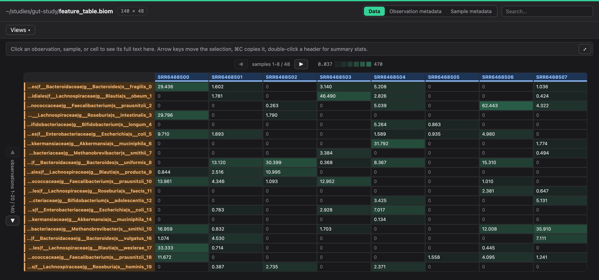
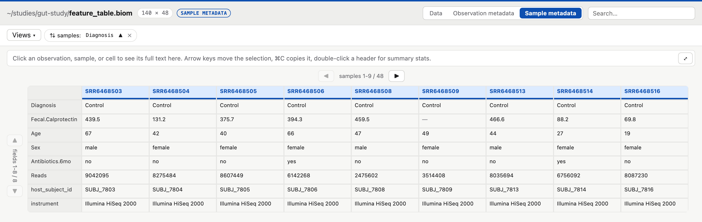
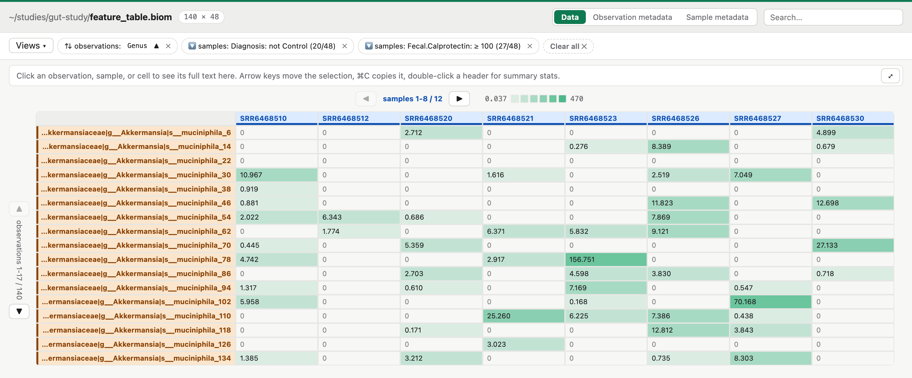
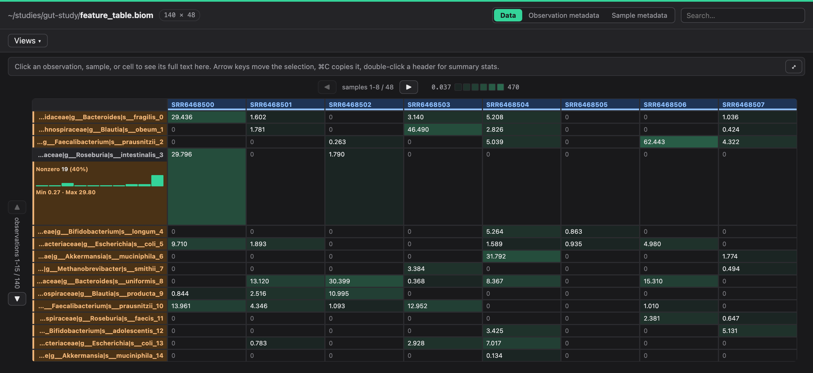
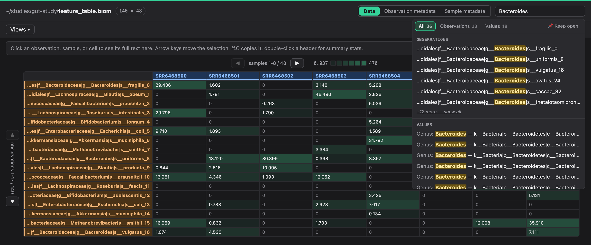

<p align="center">
  
</p>
<h1 align="center">biom-viewer</h1>
<p align="center">
  <strong>Open a <code>.biom</code> file. See it instantly.</strong><br>
  A native macOS viewer for sparse microbiome tables — no <code>biom convert</code>,
  no pandas, no waiting.
</p>

<p align="center">
  <a href="https://github.com/yarintm/biom-viewer/releases/latest"></a>
  <a href="https://github.com/yarintm/biom-viewer/releases"></a>
  <a href="LICENSE"></a>
  
</p>

<p align="center">
  <a href="https://github.com/yarintm/biom-viewer/releases/latest/download/BiomViewer-macos-arm64.zip"><strong>⬇&nbsp; Download for macOS</strong></a>
  &nbsp;·&nbsp;
  <a href="#from-source">Run from source</a>
</p>

<p align="center">
  
</p>

---

## Why

`.biom` files store microbiome data as **sparse** matrices — mostly zeros.
Every ordinary way of looking at one (`biom convert`, pandas, Excel)
densifies each implicit zero first, so a 50 MB file can balloon into
several GB of RAM before you have seen a single row.

biom-viewer keeps the table sparse and densifies only the handful of
observations and samples currently on screen. Opening a large table is
instant, and stays instant no matter how far you scroll.

## What you get

### A table you can actually read

Cells are shaded by magnitude on a log scale, so the abundant taxa stand out
of the zeros immediately instead of every non-zero value looking alike.
Taxonomy lineages are truncated from the *front*, keeping the genus and
species — the part that differs — visible.

### Metadata as a first-class view

Flip the same table into **Observation metadata** or **Sample metadata** and
your sample sheet becomes the grid: sort by diagnosis, rename a field, drop
a column, or expand one field to full height.

<p align="center">
  
</p>

### Filters that show their work

Filter samples by any metadata field — numeric ranges or category
checklists — and stack them. Every active sort and filter becomes a chip
that says exactly what it did and how much it kept (`27/48`), removable one
at a time or all at once.

<p align="center">
  
</p>

### Summary statistics, for exactly what you asked about

Double-click an observation and just that row expands in place — nonzero
count, distribution, min and max, or a top-values breakdown if it is a
categorical metadata field.

Double-click a sample header and you get the same summary for every sample
side by side, since that band spans the full width either way. Same from
**View → Show All Summary Stats**, and double-clicking again puts it away.

<p align="center">
  
</p>

### Search across everything at once

⌘F searches observation IDs, sample IDs, metadata field names and metadata
*values* together, grouped by what matched, with the matching substring
highlighted in place.

<p align="center">
  
</p>

### And the rest

- **Saved views** — name a set of filters, sorts and pins, and come back to it
- **Undo/redo** (⌘Z / ⇧⌘Z) across every edit, each step naming what it undid
- **Find & replace** across metadata values (⌘R)
- **Export** the current view as a runnable Python snippet (⌘E) or as a new
  `.biom` file (⌘S)
- Light and dark, following the system theme

## Install

**[Download the latest release](https://github.com/yarintm/biom-viewer/releases/latest)**,
unzip, and drag `BiomViewer.app` to Applications. It is self-contained —
no Python installation required.

macOS will warn that the app is from an unidentified developer the first
time. Right-click the app → **Open** → **Open** to get past it; it is
unsigned because signing needs a paid Apple Developer account.

To open `.biom` files by double-clicking: right-click one → **Get Info** →
**Open with** → **BiomViewer** → **Change All…**.

### From source

Any platform, though only macOS is packaged and tested:

```bash
pip install -e .
biom-viewer path/to/table.biom
```

## Keyboard

| | |
|---|---|
| **▲ ▼ ◀ ▶** | page through observations and samples (page size auto-fits the window) |
| **Arrow keys** | move the selection · **⌘C** copy it |
| **⌘F** | search · **⌘R** find & replace |
| **⌘Z / ⇧⌘Z** | undo / redo |
| **⌘⏎** | open the selected cell full-size |
| **⌘E / ⌘S** | export as Python / as `.biom` |
| **⌘+ / ⌘-** | font size |

Open more `.biom` files (from Finder or the CLI) and they appear as new
windows in the same running app.

## Development

```bash
git clone https://github.com/yarintm/biom-viewer.git
cd biom-viewer
python3 -m venv .venv && source .venv/bin/activate
pip install -e ".[dev]"
pytest
```

The app is a `pywebview` window — vanilla JS and CSS, no framework — talking
to a Python `Api` class that slices the sparse matrix on demand, with no HTTP
server involved. `biom_viewer/app.py` holds the window and the bridge,
`web_script.py` and `web_style.py` the UI.
`scripts/build_macos_app.sh` bundles it all into the standalone `.app` via
PyInstaller.

See [CONTRIBUTING.md](CONTRIBUTING.md) before sending a PR — the one rule
that matters is not densifying the full table.

## License

[MIT](LICENSE)
